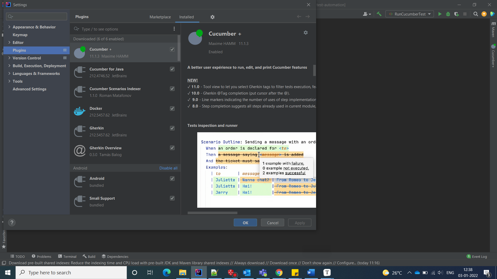

# Selenium Cucumber
Selenium Cucumber for BBD internal use

## Plugins to install

* Make sure install the below Plugins into your IDE Eclipse or IntelliJ

	
	
* Install the allure reports using Windows powerhell 

* Set the Environmental varaibles as well
	``ALLURE_HOME -- Home directory of allure-reports``
	``Path -- Bin directory of allure-reports``
	
	
	
# To Run the any feature	

* Runner file To execute any Cucumber feature, we require Runner file, and it looks like below. It executes the all-feature files which are under features folder. If you want to execute only one feature file you must mention that feature explicitly.

	
	
# To generate the reports
	
* To generate the reports go to project base directory and hit the below command on command prompt

	``allure serve``
	
	